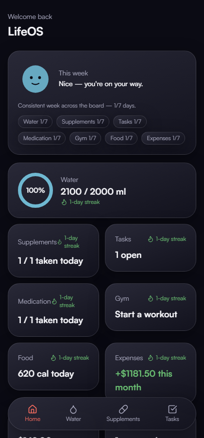
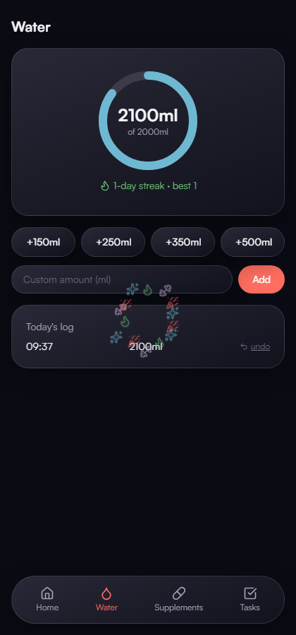
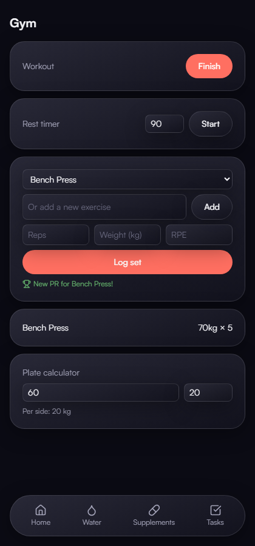
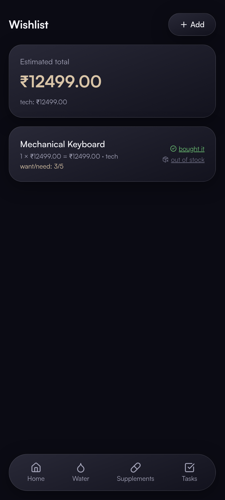
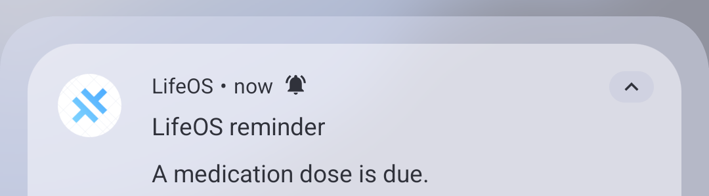
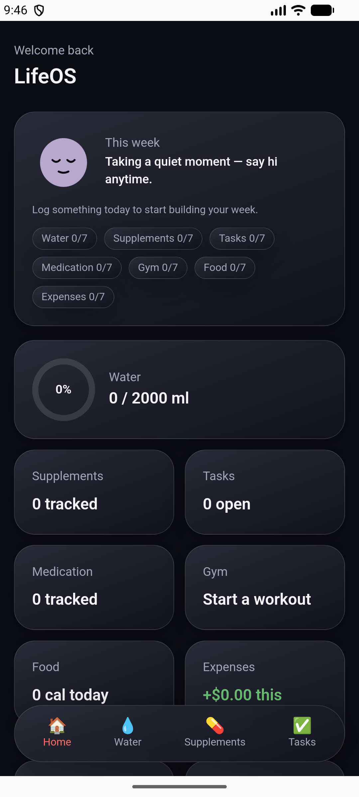

# LifeOS

**Nine trackers. One app. Zero clutter.**

Water, supplements, tasks, medication, food, gym, money, wishlist, and notes — all living behind one calm, glass-smooth interface instead of nine different apps fighting for your attention.

## Why LifeOS

Most people don't have a tracking problem — they have a *fragmentation* problem. A water app here, a habit tracker there, a separate workout log, a budgeting app you opened twice. Every one of them wants to be the center of your life, and none of them talk to each other.

LifeOS takes the opposite approach: **one home screen, one streak system, one design language**, covering everything you actually check on a daily basis. Open it once in the morning and see your whole day at a glance — not nine times.

## Everything you're already trying to track

| | |
|---|---|
| 💧 **Water** | One-tap logging with a personal daily goal and a live progress ring |
| 💊 **Supplements** | Dosing schedules, loading-phase tracking, and a live saturation percentage for things like creatine |
| ✅ **Tasks** | Daily, weekly, and monthly recurring to-dos that actually reset themselves |
| 💊 **Medication** | Gentle adherence tracking with reminders that actually reach you — a real notification, even with the app closed |
| 🍽️ **Food** | Fast calorie logging plus one-tap re-logging of your regular meals |
| 🏋️ **Gym** | Full workout sessions — set-by-set logging, a rest timer, a plate calculator, automatic personal-record detection, and one-tap starts from a saved routine |
| 💵 **Expenses** | Dead-simple money in / money out tracking, monthly budgets by category, and recurring bills that log themselves the day they're due |
| 🛍️ **Wishlist** | A running total of everything you want, scored by how much you actually need it |
| 📝 **Notes** | Instant capture for whatever's in your head right now |

## Built to feel good, not stressful

Streaks are everywhere in this app — but they're forgiving. Miss a day and a streak "freeze" quietly covers you instead of resetting everything to zero. Nothing is styled in alarm red for a missed goal; the whole app is built around the idea that consistency beats perfection.

There's also a small companion that reflects your week back at you — cheerful when you've been consistent, quietly resting when you haven't touched the app in a while, but never disappointed in you. It's not there to judge, it's there to notice.

Every week, LifeOS also puts together a short, honest summary of how things went — your strongest area, and the one that could use a little more attention — instead of burying you in charts. Give it enough time and it starts noticing real patterns across your habits too, like your best gym weeks usually being your best water weeks — quietly, and only once there's actually enough to say something true.

## A few of the details

&nbsp;&nbsp;
&nbsp;&nbsp;

 

Hit a goal for the day and the app celebrates with you — small, quick, and never in the way. Log a heavier set than ever before in the gym module and it notices immediately. Add something to your wishlist and it keeps an honest running total so "I'll just get it" decisions come with a real number attached.

## It follows through

Set a reminder on a medication or a task and LifeOS actually delivers it — a real notification on your phone at the exact time you asked for, whether the app is open, backgrounded, or fully closed. Not a browser tab nagging you while it happens to be open — a real notification, the same way any other app on your phone would send one.

## Works everywhere, even with no signal

LifeOS installs straight to your home screen like a native app and works completely offline — your data lives on your device first. Turn on sync and it quietly keeps a backup in the cloud and follows you across devices, but nothing ever depends on being connected.

*Also available as a native Android app*

## Design

Deep indigo, frosted glass surfaces, and a restrained color system where every accent color means something specific — blue for water, green for consistency, coral for action, lavender for reflection. Nothing is decorative; every visual choice is there to make the right information easier to read at a glance.

## Built with

| | Used for |
|---|---|
| **React 19 + TypeScript** | The UI itself — every screen, component, and interaction |
| **Vite** | Dev server and production bundler |
| **Dexie.js (IndexedDB)** | The on-device database every screen reads from — this is what makes the app local-first: no network round-trip for anything you see |
| **Supabase (Postgres + Auth)** | Optional background cloud sync and cross-device login, once you connect your own project |
| **Capacitor** | Wraps the same app as a real native Android app, not just a browser shortcut |
| **@capacitor/local-notifications** | Schedules genuine OS-level notifications for reminders — the piece that makes them fire even with the app closed |
| **Tailwind CSS v4** | The entire design system — colors, spacing, glass surfaces — as design tokens |
| **Motion (Framer Motion)** | Every animation: streak celebrations, tap feedback, the companion's breathing motion |
| **Lucide** | Every icon in the app |
| **Satoshi** (self-hosted) | Typography, loaded from the app itself rather than an external font CDN, so it never depends on a network connection |
| **React Router** | Navigation between pages |
| **date-fns / date-fns-tz** | Timezone-safe date math behind the streak engine, so travel and DST changes never break a streak |
| **vite-plugin-pwa (Workbox)** | The installable, offline-capable service worker |
| **Vitest** | The test suite — 120+ unit tests covering the streak logic, sync engine, and pattern-detection math |

---

*A calmer way to keep track of everything.*

